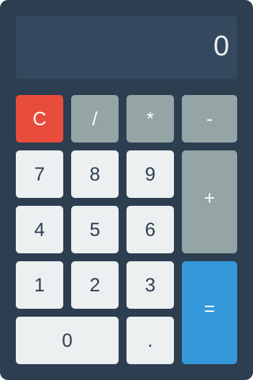

# Simple Web Calculator

[](LICENSE)

A clean and responsive web-based calculator that performs basic arithmetic operations. Built with vanilla HTML, CSS, and JavaScript without any external frameworks or libraries, this project demonstrates fundamental web development principles while providing a practical tool for everyday calculations.

### Calculator Interface



*The calculator features a clean, modern design with a digital display and an intuitive button layout for performing basic arithmetic operations.*

## Table of Contents

- [Prerequisites](#prerequisites)
- [Installation](#installation)
- [Usage](#usage)
- [Contributing](#contributing)
- [Roadmap](#roadmap)
- [License](#license)
- [Acknowledgements](#acknowledgements)

## Prerequisites

### Supported Browsers

This calculator works on modern web browsers with the following minimum versions:

- Google Chrome >= 90
- Mozilla Firefox >= 88
- Microsoft Edge >= 90

### Running the Application

This is a static HTML/CSS/JavaScript application that can be run in two ways:

#### Option 1: Direct File Opening

You can open the main HTML file directly in your browser by double-clicking it or using File > Open in your browser. This works for basic functionality, though some browsers may restrict certain features when loading files via the file:// protocol.

#### Option 2: Using a Simple HTTP Server (Recommended)

Running the application through an HTTP server is recommended for the best experience and full functionality. Choose one of the following methods based on what you have installed:

**Using Python 3:**

```bash
python -m http.server 8000
```

Then open http://localhost:8000 in your browser.

**Using Python 2:**

```bash
python -m SimpleHTTPServer 8000
```

Then open http://localhost:8000 in your browser.

**Using Node.js (http-server):**

If you don't have http-server installed, install it globally:

```bash
npm install -g http-server
```

Then run:

```bash
http-server -p 8080
```

Or use npx to run without installing:

```bash
npx http-server -p 8080
```

Then open http://localhost:8080 in your browser.

**Using PHP:**

```bash
php -S localhost:8000
```

Then open http://localhost:8000 in your browser.

## Installation

### 1. Clone the Repository

Clone this repository to your local machine using Git:

```bash
git clone https://github.com/sahanpinavida/tester05.git
cd tester05
```

Alternatively, you can download the repository as a ZIP file from GitHub and extract it to your desired location.

### 2. Launch the Calculator

Once you have the project files on your local machine, you can launch the calculator using one of the following methods:

#### Method A: Direct File Opening

1. Navigate to the project directory
2. Locate the `index.html` file
3. Open it in your web browser by:
   - Double-clicking the file, or
   - Right-clicking and selecting "Open with" and choosing your preferred browser, or
   - Dragging the file into an open browser window

This method is quick and simple for immediate testing and usage.

#### Method B: Using an HTTP Server (Recommended for Development)

1. Open a terminal or command prompt
2. Navigate to the project root directory (where `index.html` is located)
3. Start a simple HTTP server using one of the methods described in the [Prerequisites](#prerequisites) section
4. Open the provided localhost URL in your browser (e.g., http://localhost:8000)

This method is recommended because:

- It mirrors the production environment when deployed to GitHub Pages or static hosting
- It avoids potential browser security restrictions with the file:// protocol
- It provides a more accurate testing environment for web features

For detailed HTTP server setup instructions, see the [Running the Application](#running-the-application) section under Prerequisites.

## Usage

The calculator provides a simple and intuitive interface for performing basic arithmetic operations. Enter numbers by clicking the digit buttons, select your desired operation, and press the equals button to see the result.

### Basic Operations

The calculator supports four fundamental arithmetic operations. Below are step-by-step examples for each:

#### Addition

To add two numbers together:

**Example: 15 + 27**

1. Click the digits '1' and '5' to enter 15
2. Click the '+' (plus) button
3. Click the digits '2' and '7' to enter 27
4. Click the '=' (equals) button

**Result:** 42

#### Subtraction

To subtract one number from another:

**Example: 50 - 18**

1. Click the digits '5' and '0' to enter 50
2. Click the '-' (minus) button
3. Click the digits '1' and '8' to enter 18
4. Click the '=' (equals) button

**Result:** 32

#### Multiplication

To multiply two numbers:

**Example: 8 * 5**

1. Click the digit '8' to enter 8
2. Click the '*' or 'x' (multiply) button
3. Click the digit '5' to enter 5
4. Click the '=' (equals) button

**Result:** 40

#### Division

To divide one number by another:

**Example: 100 / 5**

1. Click the digits '1', '0', and '0' to enter 100
2. Click the '/' or '÷' (divide) button
3. Click the digit '5' to enter 5
4. Click the '=' (equals) button

**Result:** 20

### Tips for Using the Calculator

- **Clear the display:** Click the 'C' (Clear) or 'AC' (All Clear) button to reset the calculator and start a new calculation
- **Decimal numbers:** Use the '.' (decimal point) button to enter decimal values for more precise calculations
- **Continuous operations:** After getting a result, you can continue calculating by pressing an operator button to use the result in a new operation
- **Display:** All inputs and results are shown in the calculator's display area at the top of the interface

## Contributing

We welcome contributions to the Simple Web Calculator project! Please follow these guidelines to ensure a smooth collaboration process.

### Getting Started

#### Fork and Clone

1. Fork the repository on GitHub by clicking the "Fork" button
2. Clone your fork to your local machine:

```bash
git clone https://github.com/YOUR_USERNAME/tester05.git
cd tester05
```

3. Add the upstream repository as a remote to keep your fork synchronized:

```bash
git remote add upstream https://github.com/sahanpinavida/tester05.git
```

#### Create a Feature Branch

Always create a new branch for your work. Use the following naming convention:

**Branch Naming Format:**

```
feature/{issue-number}-{short-description}
fix/{issue-number}-{short-description}
docs/{issue-number}-{short-description}
```

**Examples:**

```bash
git checkout -b feature/42-add-keyboard-support
git checkout -b fix/15-division-by-zero
git checkout -b docs/23-update-usage-guide
```

### Coding Standards

Please adhere to these coding standards to maintain consistency throughout the project:

#### HTML

- Use semantic HTML5 elements (e.g., `<button>`, `<main>`, `<section>`)
- Maintain proper document structure and hierarchy
- Use descriptive class and id names that reflect purpose
- Keep markup clean and well-indented

#### CSS

- Use class-based selectors for styling
- Maintain consistent indentation (spaces, not tabs)
- Organize styles logically by component or section
- Avoid inline styles
- Use meaningful class names that describe function, not appearance

#### JavaScript

- Write single-responsibility functions (each function does one thing)
- Use descriptive variable and function names (e.g., `calculateResult`, not `calc`)
- Add inline comments to explain key logic and complex operations
- Avoid global variables when possible
- Keep functions small and focused
- Use camelCase for variable and function names

#### General Guidelines

- No external libraries or frameworks - vanilla HTML/CSS/JS only
- Keep code clean, readable, and modular
- Test your changes in all supported browsers (Chrome >= 90, Firefox >= 88, Edge >= 90)
- Ensure the calculator works both when opened directly and via HTTP server

### Commit Message Convention

Follow this simple and consistent format for all commit messages:

**Format:**

```
type: short description of changes
```

**Commit Types:**

- `feat`: New feature or functionality
- `fix`: Bug fix
- `docs`: Documentation changes
- `style`: Code style/formatting (no functional changes)
- `refactor`: Code refactoring (no functional changes)
- `test`: Adding or updating tests
- `chore`: Maintenance tasks, build changes

**Examples:**

```bash
git commit -m "feat: add keyboard input support for calculator"
git commit -m "fix: correct division by zero error handling"
git commit -m "docs: update installation instructions for Windows"
git commit -m "style: improve button spacing and alignment"
git commit -m "refactor: simplify calculation logic in main function"
```

**Guidelines:**

- Keep the first line under 72 characters
- Use lowercase for the type
- Use imperative mood ("add" not "added" or "adds")
- Be specific but concise
- For complex changes, add a blank line and detailed explanation in the body

### Submitting Your Changes

1. **Commit your changes** with clear, descriptive commit messages following the convention above

2. **Push to your fork:**

```bash
git push origin feature/42-add-keyboard-support
```

3. **Open a Pull Request** on GitHub:
   - Navigate to the original repository
   - Click "New Pull Request"
   - Select your fork and branch
   - Provide a clear title and description
   - Link any related issues (e.g., "Closes #42")

4. **Respond to feedback** from code reviewers promptly and make requested changes

### Pull Request Guidelines

- **Focus:** Keep PRs focused on a single feature, fix, or improvement
- **Testing:** Test your changes thoroughly before submitting
- **Documentation:** Update relevant documentation (README, comments) if needed
- **Code Quality:** Ensure your code follows all coding standards
- **Description:** Provide a clear description of what changes you made and why
- **Issues:** Reference related issues using GitHub's issue linking syntax

### Code Review Process

All contributions go through a code review process:

1. A project maintainer will review your pull request
2. They may request changes, ask questions, or suggest improvements
3. Make any requested changes and push them to your branch
4. Once approved, a maintainer will merge your contribution

Please be patient and responsive during the review process. We appreciate your contributions!

### Questions or Issues?

If you have questions about contributing, please open an issue on GitHub or reach out to the project maintainers.

When creating issues or pull requests, please use our templates to provide all necessary information:

- [Issue Template](.github/ISSUE_TEMPLATE.md) - For bug reports, feature requests, and questions
- [Pull Request Template](.github/PULL_REQUEST_TEMPLATE.md) - Automatically populated when you open a PR

## Roadmap

Information about planned features and version history will be available in this section.

## License

This project is licensed under the MIT License - see the [LICENSE](LICENSE) file for details.

The MIT License is a permissive license that allows for reuse, modification, and distribution of this software with minimal restrictions. You are free to use this calculator in your own projects, both personal and commercial.

## Acknowledgements

Credits and acknowledgements for contributors and resources used in this project.
